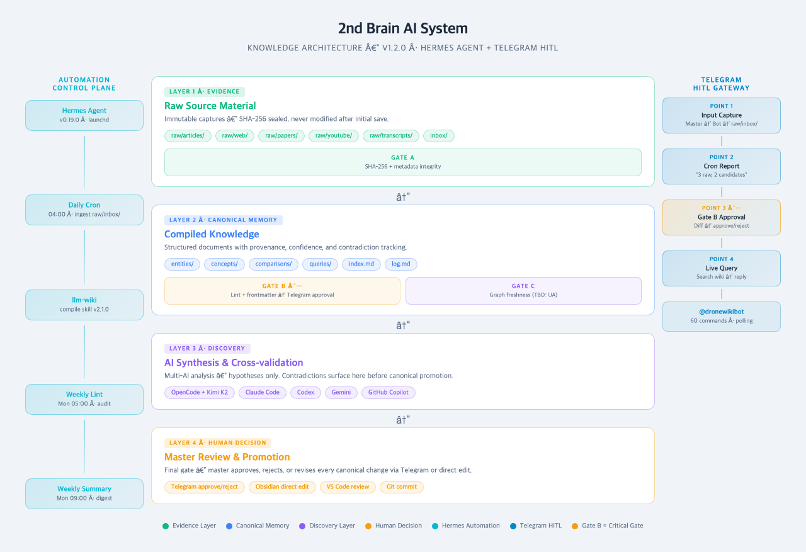
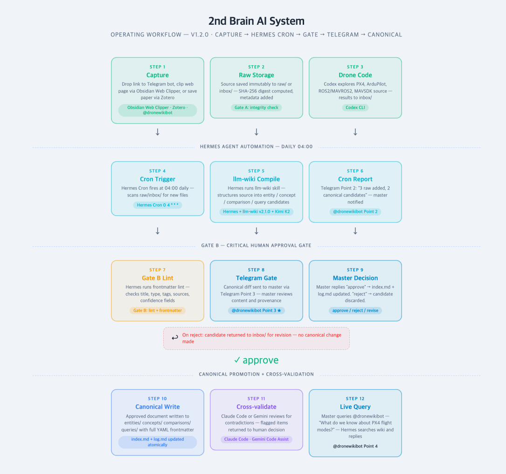
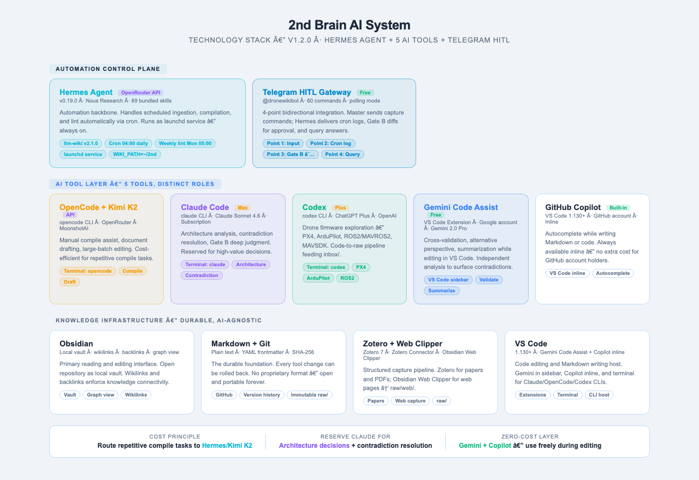

# 2nd Brain AI 시스템

[English](README.md) | **한국어**

> Markdown과 Git 기반 드론 도메인 지식 관리 시스템 — **Hermes Agent 자동화 + 5종 AI 도구 스택 + 텔레그램 HITL** 탑재.

## 프로젝트 개요

이 프로젝트는 **드론 기술** (8개 주제 영역: drone / datalink / swarm / voice-control / drone-hw / drone-sw / drone-ai / ai-agent) 에 특화된 개인 지식 관리 시스템입니다. Obsidian, VS Code, GitHub 등 어떤 Markdown 도구와도 호환되는 일반 Markdown 파일을 사용해 **캡처 → 컴파일 → 발견 → 인간 결정**의 지속적 워크플로우를 구현합니다.

[ains-lab/2nd-brain-template](https://github.com/ains-lab/2nd-brain-template) 기반으로 커스텀 AI 도구 레이어, Hermes Agent 자동화, 텔레그램 HITL 통합을 추가 구성한 시스템입니다.

### 아키텍처

시스템은 4개 지식 계층으로 구성됩니다: **증거 → 정식 메모리 → 발견 → 인간 결정**. 원본 소스 자료는 `raw/`에 불변 증거로 보존되며, 재사용 가능한 지식은 추적 가능한 출처와 함께 정식 Markdown으로 컴파일됩니다.

**자동화 제어 플레인** (Hermes Agent + llm-wiki 스킬)이 예약된 수집, 컴파일, 린트를 자동 처리합니다. **텔레그램 HITL 게이트웨이**는 diff 리포트를 마스터에게 전달하고, 명시적 승인이 있어야만 정식 메모리 승격이 이루어집니다 — 인간의 확인 없이는 AI 가설이 정식 메모리에 진입할 수 없습니다.



### 운영 워크플로우

운영 워크플로우는 **캡처 → Hermes Cron → Gate A/B/C → 텔레그램 승인 → 정식화** 순서로 진행됩니다. 3개 무결성 게이트 (Gate A: raw 무결성 / Gate B: 린트+프론트매터 / Gate C: 그래프 신선도)가 자동 실행됩니다. Gate B 결과는 정식 변경이 확정되기 전에 텔레그램으로 마스터에게 전달되어 인간 검토를 거칩니다.



### 기술 스택

스택은 Hermes Agent 자동화와 각각 고유한 역할을 가진 5종 AI 도구를 결합합니다. 오픈 형식 Markdown, 출처 메타데이터, Git 히스토리가 내구성 있는 자산이며 AI 도구와 자동화 엔진은 교체 가능한 레이어입니다.



---

## 자동화 제어 플레인 — Hermes Agent

[Hermes Agent](https://github.com/NousResearch/hermes-agent) (v0.19.0)는 수동 컴파일 루프를 예약된 파이프라인으로 대체하는 자동화 핵심 엔진입니다.

| 역할 | 도구 | 트리거 |
| --- | --- | --- |
| **일일 수집** | Hermes + llm-wiki 스킬 | Cron `0 4 * * *` — `raw/inbox/` 스캔, 정식 후보 컴파일 |
| **주간 린트** | Hermes + wiki 감사 | Cron `0 5 * * 1` — 고아 페이지, 깨진 링크, 오래된 페이지, SHA-256 드리프트 검사 |
| **주간 요약** | Hermes 게이트웨이 | Cron `0 9 * * 1` — 주간 지식 다이제스트를 텔레그램으로 전달 |
| **텔레그램 게이트웨이** | Hermes 게이트웨이 (launchd) | 상시 가동 — 캡처 명령 수신, Gate B diff를 승인을 위해 전달 |

### 텔레그램 HITL — 4포인트 통합

```
[포인트 1: 입력]      마스터 → 텔레그램 → Hermes → raw/inbox/
[포인트 2: Cron 로그] Hermes Cron → 텔레그램: "원본 3개 추가, 정식 후보 2개"
[포인트 3: 게이트]    Gate B diff → 텔레그램 → 마스터: 승인 / 거부 / 수정
[포인트 4: 쿼리]      마스터 → 텔레그램 → Hermes → wiki 검색 → 답변
```

포인트 3이 핵심 게이트입니다: Hermes가 정식 diff를 텔레그램으로 전송하고, 마스터의 답변(`approve` / `reject`)에 따라 `index.md`와 `log.md` 업데이트 여부가 결정됩니다.

---

## AI 도구 역할

이 시스템에는 6종 도구가 구성되어 있으며, 각각의 책임은 [AGENTS.md](AGENTS.md)에 정의되어 있습니다.

| 도구 | 인터페이스 | 주요 역할 |
| --- | --- | --- |
| **Hermes + llm-wiki** | 게이트웨이 / Cron | 자동 수집, 컴파일, 린트, 텔레그램 전달 |
| **OpenCode + Kimi K2** | 터미널 (`opencode`) | 수동 컴파일 지원, 문서 초안 작성, 대량 편집 |
| **Claude Code** | 터미널 (`claude`) | 아키텍처 분석, 모순 검토, Gate B 심층 판단 |
| **Codex** | 터미널 (`codex`) | 드론 펌웨어 탐색 (PX4/ArduPilot/ROS2), 코드→raw 파이프라인 |
| **Gemini Code Assist** | VS Code 사이드바 | 교차 검증, 대안 관점, 편집 중 요약 |
| **GitHub Copilot** | VS Code 인라인 | Markdown 또는 코드 작성 중 자동완성 |
| **Understand Anything** | Hermes 스킬 / Claude Code | Gate C — 지식그래프 생성, 공백 분석, 구조적 관측 |

> **비용 원칙**: 반복 컴파일 작업은 Hermes/Kimi K2로 라우팅. Claude는 아키텍처 결정과 모순 해소에 예약. Gemini와 Copilot은 무료 — 편집 중 자유롭게 사용.

---

## 드론 도메인 커버리지

주요 지식 도메인은 8개 등록 태그 카테고리에 걸친 **드론 기술**입니다 ([SCHEMA.md](SCHEMA.md) 및 [docs/domain/drone-domain-guide.md](docs/domain/drone-domain-guide.md) 참조).

| 태그 | 범위 |
| --- | --- |
| `drone` | 일반 시스템 — 기체, 비행 역학, 규제, 임무 계획 |
| `datalink` | RF, LTE, MAVLink 텔레메트리, C2 링크, 암호화 |
| `swarm` | 멀티드론 조정, 편대 비행, 합의 알고리즘 |
| `voice-control` | 드론 운용을 위한 자연어/음성 명령 인터페이스 |
| `drone-hw` | 하드웨어 — FC, ESC, 모터, 배터리, LiDAR, 카메라, 페이로드 |
| `drone-sw` | PX4, ArduPilot, GCS, MAVSDK, ROS/ROS2, MAVROS/MAVROS2, uORB |
| `drone-ai` | 컴퓨터 비전, 자율 비행, SLAM, 객체 감지, 세그멘테이션 |
| `ai-agent` | AI 에이전트 아키텍처, 자율 의사결정, 멀티에이전트 시스템 |

수집 우선순위: `drone-sw` → `datalink` → `drone-ai` → `swarm` → 기타.

---

## 주요 기능

| 기능 | 설명 |
| --- | --- |
| **자동화 수집 파이프라인** | Hermes Agent Cron이 매일 04:00에 `raw/inbox/`를 스캔하고, llm-wiki 스킬을 실행해 정식 후보를 컴파일한 후 결과를 텔레그램으로 전달합니다. |
| **텔레그램 HITL 게이트** | Gate B diff가 마스터 승인을 위해 텔레그램으로 전달됩니다. 명시적 `approve` 답변 없이는 어떤 정식 변경도 확정되지 않습니다. |
| **소스와 출처 보존** | Zotero와 Obsidian Web Clipper로 논문과 웹 자료를 캡처한 후 소스, 메타데이터, SHA-256 다이제스트를 `raw/` 아래에 보존해 모든 주장을 증거까지 추적할 수 있습니다. |
| **검증된 지식 컴파일** | Hermes llm-wiki 스킬과 OpenCode + Kimi K2가 소스 자료를 출처, 신뢰도 평가, 모순 추적을 포함한 엔티티, 개념, 비교, 쿼리 문서로 구조화합니다. |
| **연결된 Markdown 편집** | Obsidian에서 wikilinks와 역방향 링크를 사용해 지속적 지식을 읽고 편집하며, GitHub Copilot과 Gemini Code Assist가 편집 중 인라인으로 지원합니다. |
| **멀티 AI 교차 검증** | Claude Code와 Gemini가 동일 증거에 대해 독립적 분석을 제공 — 지식이 정식으로 승격되기 전에 모순이 표면화됩니다. |
| **드론 코드 탐색** | Codex가 PX4, ArduPilot, ROS2/MAVROS2, MAVSDK 소스 코드를 탐색하며, 결과는 `raw/inbox/`에 저장되어 Hermes가 컴파일 시 수집합니다. |
| **지식그래프 (Gate C)** | Understand Anything `understand-knowledge` 스킬이 위키를 분석해 인터랙티브 지식그래프(`.ua/knowledge-graph.json`)를 생성 — 클러스터, 공백, 구조적 약한 연결을 자동으로 표면화합니다. |

---

## 사전 준비 사항

### 캡처 도구

| 분류 | 도구 | 목적 |
| --- | --- | --- |
| 필수 | [Obsidian](https://obsidian.md/download) | 이 저장소를 로컬 볼트로 열어 Markdown을 탐색하고 편집합니다. |
| 논문 캡처 | [Zotero + Zotero Connector](https://www.zotero.org/download/) | 드론 논문과 PDF를 관리하고 브라우저에서 메타데이터를 저장합니다. |
| 웹 캡처 | [Obsidian Web Clipper](https://obsidian.md/clipper) | 웹 페이지를 `raw/web/` Markdown 파일로 변환합니다. |

### 자동화 및 메시징

| 도구 | 목적 | 설정 |
| --- | --- | --- |
| [Hermes Agent](https://github.com/NousResearch/hermes-agent) | 자동화 제어 플레인 — llm-wiki, cron, 텔레그램 게이트웨이 | `curl -fsSL https://hermes-agent.nousresearch.com/install.sh \| bash` |
| 텔레그램 봇 | HITL 알림 및 승인 게이트웨이 | [@BotFather](https://t.me/BotFather)로 생성, 토큰을 `~/.hermes/.env`에 설정 |

### AI 도구

| 도구 | 인증 방법 | 설정 |
| --- | --- | --- |
| [OpenCode](https://opencode.ai) + Kimi K2 | OpenRouter API 키 | 터미널에서 `opencode providers login openrouter` |
| [Claude Code](https://claude.ai/code) | Claude Max 구독 | `claude` — 첫 실행 시 브라우저로 로그인 |
| [Codex](https://github.com/openai/codex) | ChatGPT Plus 구독 | `codex` — 첫 실행 시 브라우저로 로그인 |
| [Gemini Code Assist](https://marketplace.visualstudio.com/items?itemName=Google.geminicodeassist) | Google 계정 (무료) | VS Code 확장 설치 후 Google로 로그인 |
| [GitHub Copilot](https://github.com/features/copilot) | GitHub 계정 (기본 제공) | VS Code 1.130+에 내장됨; GitHub로 로그인 |

### 권장 설정 순서

1. 이 저장소를 클론하고 Obsidian에서 볼트로 열기.
2. Zotero, Zotero Connector, Obsidian Web Clipper 설치.
3. npm으로 OpenCode, Claude Code CLI, Codex CLI 설치.
4. VS Code에 Gemini Code Assist 확장 설치; GitHub로 Copilot 로그인.
5. Hermes Agent 설치: `curl -fsSL https://hermes-agent.nousresearch.com/install.sh | bash`
6. `~/.hermes/.env`에 `WIKI_PATH`, `OPENROUTER_API_KEY`, `TELEGRAM_BOT_TOKEN` 설정.
7. 게이트웨이 시작: `hermes gateway install --start-now --start-on-login`
8. Hermes 텔레그램 봇 또는 CLI로 크론 작업 구성.

---

## 디렉토리 구조

```text
.
├── inbox/                    # 임시 수집함 — Hermes가 매일 04:00에 처리
├── raw/                      # 불변 소스 증거
│   ├── articles/             # 아티클 및 웹 클리핑 소스 텍스트
│   ├── notebooklm/           # NotebookLM 소스 레코드
│   ├── papers/files/         # 논문 첨부파일 (플레이스홀더 전용)
│   ├── transcripts/          # 오디오, 비디오, 미팅 트랜스크립트
│   ├── web/                  # 웹 캡처 (임포터 보존 경로)
│   ├── youtube/              # YouTube 메타데이터 및 트랜스크립트
│   └── assets/               # 소스 레코드가 참조하는 이미지
├── entities/                 # 정식 지식 — 사람, 조직, 도구
├── concepts/                 # 정식 지식 — 개념, 원칙
├── comparisons/              # 정식 병렬 분석
├── queries/                  # 소스 기반 질문과 답변
├── docs/
│   ├── architecture/         # 시스템 아키텍처 다이어그램 및 사양
│   ├── domain/               # 드론 도메인 수집 가이드
│   ├── tech-stack/           # 기술 스택 다이어그램
│   └── workflow/             # 운영 워크플로우 다이어그램
├── templates/                # 프론트매터 템플릿 (raw-article / entity / concept / comparison / query)
├── _archive/                 # 대체된 정식 페이지
├── AGENTS.md                 # AI 도구 역할 정의 및 도메인 포커스
├── CLAUDE.md                 # Claude Code 전용 지침
├── SCHEMA.md                 # 권위 있는 데이터 계약
├── index.md                  # 활성 정식 지식 카탈로그
└── log.md                    # 추가 전용 운영 이력
```

---

## 빠른 시작

### 1. 저장소 클론

```bash
git clone https://github.com/krill0188/2nd-brain-ai-system.git
cd 2nd-brain-ai-system
```

### 2. 에디터에서 열기

- **Obsidian**: `폴더를 볼트로 열기` → 저장소 디렉토리 선택.
- **VS Code**: `code .` 또는 `code ~/2nd` (~/2nd에 클론한 경우).

### 3. 지식 세션 시작

```bash
# 자동화 파이프라인 — Hermes가 일일 수집 처리
hermes gateway status

# 수동 컴파일 지원 — Kimi K2
cd ~/2nd && opencode

# 아키텍처 / 모순 분석 — Claude
cd ~/2nd && claude

# 드론 코드 탐색 — Codex (결과는 raw/inbox/로)
cd ~/2nd && codex
```

### 4. 텔레그램으로 캡처 명령 전송

```
[텔레그램 → @dronewikibot]
"이 링크를 수집해서 raw/inbox/에 저장해줘: https://docs.px4.io/..."
```

Hermes가 콘텐츠를 `raw/inbox/`에 저장하고 다음 크론 실행 시 컴파일합니다.

### 5. 운영 계약 읽기

지식을 추가하기 전에 [SCHEMA.md](SCHEMA.md)를 읽고, [index.md](index.md)에서 이미 다루어진 주제를 확인하고, [log.md](log.md)의 최신 항목을 검토하세요.

---

## 기본 워크플로우

1. **캡처**: 텔레그램에 링크를 전송하거나 Obsidian Web Clipper로 웹 페이지를 `raw/web/`에 저장. 논문은 Zotero → `raw/articles/`.
2. **자동 수집**: Hermes Cron (매일 04:00)이 `raw/inbox/`를 스캔하고, llm-wiki로 정식 후보를 컴파일한 후 텔레그램 리포트를 전송.
3. **Gate B 승인**: Hermes가 정식 diff를 텔레그램으로 전달. `approve`로 확정하거나 `reject`로 폐기.
4. **교차 검증**: Gemini나 Claude에게 초안을 검토해 모순이나 누락된 커버리지를 찾도록 요청.
5. **탐색**: 지식 그래프 제안을 가설로 취급. 인간이 검증한 결과만 정식으로 승격.
6. **쿼리**: 텔레그램 봇에 직접 질문 — `"PX4 비행 모드에 대해 무엇을 수집했나요?"` — Hermes가 wiki를 검색해 답변.
7. **아카이브**: 완전히 대체된 페이지를 `_archive/`로 이동, 링크 수정, 운영을 `log.md`에 기록.

---

## 데이터 관리 원칙

> [!IMPORTANT]
> `README.ko.md`는 사용 가이드입니다; [SCHEMA.md](SCHEMA.md)가 권위 있는 데이터 계약입니다. 둘이 다르게 보일 때는 `SCHEMA.md`를 따르세요.

- **소스 본문은 불변입니다.** 초기 캡처 후 `raw/` 콘텐츠를 수정하지 않습니다.
- **소스 경로는 존재해야 합니다.** 정식 `sources`는 등록된 `raw/` 디렉토리 아래의 실제 Markdown 파일만 포함할 수 있습니다.
- **정식 지식은 선택적입니다.** 주제가 하나의 소스에서 핵심이거나 최소 두 소스에 걸쳐 반복될 때만 승격합니다.
- **정식 지식은 연결되어 있습니다.** 모든 활성 정식 페이지는 `[[wikilinks]]`를 통해 최소 두 개의 다른 활성 정식 페이지와 링크되어야 합니다.
- **변경은 원자적입니다.** 정식 생성/업데이트/아카이브는 `index.md` 업데이트와 `log.md` 추가가 함께 완료되어야 완성입니다.
- **Git에 비밀정보 없음.** API 키, 봇 토큰, 로그인 세션을 이 저장소에 커밋하지 않습니다. `~/.hermes/.env`는 로컬 전용으로 유지합니다.

---

## 동기화

```bash
git add .
git commit -m "feat: add drone-sw canonical pages (PX4 architecture)"
git push
```

히스토리를 위해 Git을 사용합니다. API 키, 토큰, 로그인 세션은 절대 저장소에 저장하지 않습니다.

---

## 라이선스

[ains-lab/2nd-brain-template](https://github.com/ains-lab/2nd-brain-template) 기반. Hermes Agent 자동화 및 텔레그램 HITL을 포함한 드론 도메인 AI 지식 관리를 위해 조정 및 확장됨.
